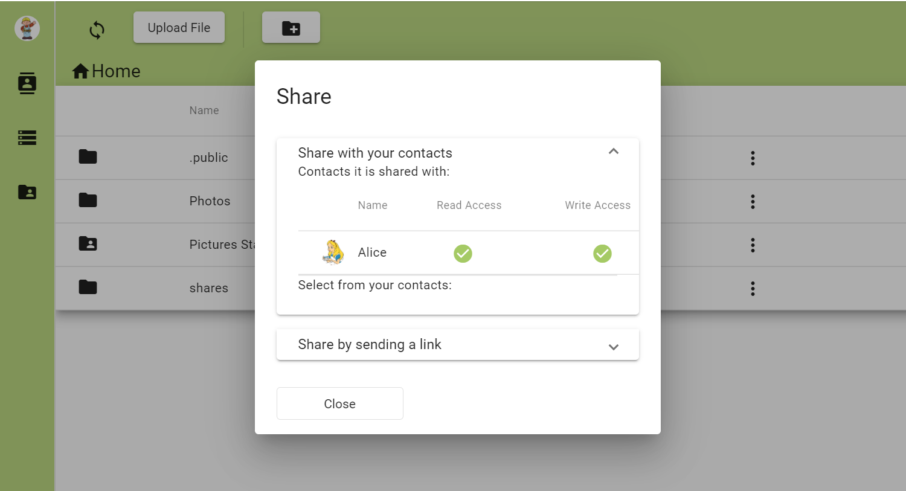

# CertaCrypt

Effort to create an access-control-system for [Hyperdrive](https://hypercore-protocol.org/#hyperdrive) and the [Hypercore Protocol](hypercore-protocol.org/) in general. 
It is designed with the [Local-First Software Principles](https://www.inkandswitch.com/local-first.html) in mind.
At it's heart it is powered by a customly written graph DB that implements access control entirely using a cryptographic [capability access control model](https://en.wikipedia.org/wiki/Capability-based_security).

## Goals

In order to simplify the development of local-first software, this adds access control to Hyperdrive:

- fine-grained per-file and per-directory control of read- and write permissions
- sharing files either by URL or with known contacts in-app
- ability to give replication- and verification-capabilities without giving read access
- basic user and identity management

## Demo

[Certacrypt Filemanager](https://github.com/fsteff/certacrypt-filemanager) is the demo application for CertaCrypt

## Sub-Components

- [HyperObjects](https://github.com/fsteff/hyperobjects) is a transaction-log based object store built on [Hypercore](https://github.com/hypercore-protocol/hypercore)
- [Hyper-GraphDB](https://github.com/fsteff/hyper-graphdb) is a Graph-DB built on HyperObjects
- [CertaCrypt-Graph](https://github.com/fsteff/certacrypt-graph) implements capability-based access control for Hyper-GraphDB
- [CertaCrypt-Crypto](https://github.com/fsteff/certacrypt-crypto) provides the cryptography for CertaCrypt and is designed to be interchangeable
- [HyperPubSub](https://github.com/fsteff/hyperpubsub) is utilized as a PubSub system on top of existing Hyperswarm P2P connections

## Concept Documents

- *[Initial Concept "Paper"](https://github.com/fsteff/certacrypt/blob/master/docs/concept.pdf) (old)*
- [Drive](https://github.com/fsteff/certacrypt/blob/master/docs/drive.md)
- [Multiwriter / Collaboration Spaces](https://github.com/fsteff/certacrypt/blob/master/docs/multiwriter.md)
- [Inbox](https://github.com/fsteff/certacrypt/blob/master/docs/inbox.md)
- [Pre-Shared Vertices](https://github.com/fsteff/certacrypt/blob/master/docs/preshared-vertices.md)
- [Private Communication Channels](https://github.com/fsteff/certacrypt/blob/master/docs/private-commchannel.md)
- [Open Communication Channel](https://github.com/fsteff/certacrypt/blob/master/docs/open-commchannel.md)
- [Multiwriter CRDT](https://github.com/fsteff/certacrypt/blob/master/docs/crdt.md)  
- [App Sessions](https://github.com/fsteff/certacrypt/blob/master/docs/session.md)
- [Contacts](https://github.com/fsteff/certacrypt/blob/master/docs/contacts.md)
- [Permission Revocation](https://github.com/fsteff/certacrypt/blob/master/docs/revocation.md)

## Context

This has been developed as part of a master thesis (available soon), supervised by the [Institute of Networks and Security](https://www.ins.jku.at/), Johannes Kepler University Linz (Austria).
(c) Stefan Fixl, 2022.

### Misc

[External Resources](https://github.com/fsteff/certacrypt/blob/master/docs/resources.md)

[FAQ](https://github.com/fsteff/certacrypt/blob/master/docs/faq.md)